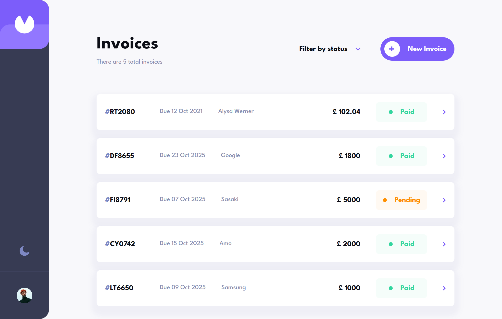

# Frontend Mentor - Invoice app solution

This is a solution to the [Invoice app challenge on Frontend Mentor](https://www.frontendmentor.io/challenges/invoice-app-i7KaLTQjl). Frontend Mentor challenges help you improve your coding skills by building realistic projects.

## Table of contents

- [Overview](#overview)
  - [The challenge](#the-challenge)
  - [Screenshot](#screenshot)
  - [Links](#links)
- [My process](#my-process)
  - [Built with](#built-with)
  - [What I learned](#what-i-learned)
  - [Continued development](#continued-development)
  - [Useful resources](#useful-resources)
- [Author](#author)
- [Acknowledgments](#acknowledgments)

**Note: Delete this note and update the table of contents based on what sections you keep.**

## Overview

### The challenge

Users should be able to:

- View the optimal layout for the app depending on their device's screen size
- See hover states for all interactive elements on the page
- Create, read, update, and delete invoices
- Receive form validations when trying to create/edit an invoice
- Save draft invoices, and mark pending invoices as paid
- Filter invoices by status (draft/pending/paid)
- Toggle light and dark mode
- Keep track of any changes, even after refreshing the browser

### Screenshot

### Links

- Solution URL: [https://github.com/nikosetiawanp/invoice-app](https://github.com/nikosetiawanp/invoice-app)
- Live Site URL: [https://nikosetiawanp.github.io/invoice-app/](https://nikosetiawanp.github.io/invoice-app/)

## My process

### Built with

### What I learned

- I learned on how to use react-hook-form dynamic input and controlled input
- How to implement shadcn datepicker into my own project and customize its color
- How to use localstorage alongside Tanstack Query for live update

### Continued development

Use this section to outline areas that you want to continue focusing on in future projects. These could be concepts you're still not completely comfortable with or techniques you found useful that you want to refine and perfect.

### Useful resources

- [https://react-hook-form.com/docs/usefieldarray](https://react-hook-form.com/docs/usefieldarray) - Helped me implement dynamic field arrays.
- [https://tanstack.com/query/latest/docs/framework/react/guides/queries](https://tanstack.com/query/latest/docs/framework/react/guides/queries) - Helped me set up CRUD operations.

## Author

- Github - [Niko Setiawan P.](https://github.com/nikosetiawanp)
- Frontend Mentor - [@nikosetiawanp](https://www.frontendmentor.io/profile/nikosetiawanp)
